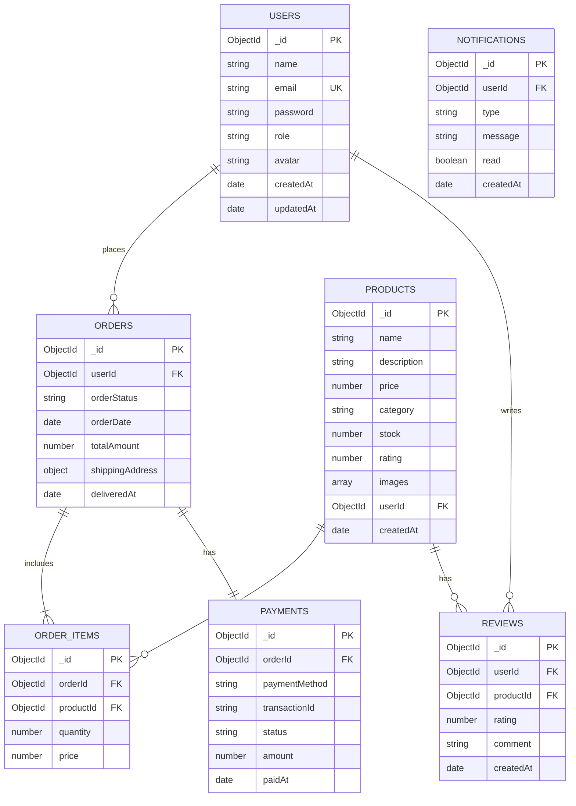

# 🏗️ AutoMERNate Architecture Diagrams

**MLOps Assignment #2 - System Architecture Documentation**

**Author:** Muhammad Bilal Raza Attari  
**Date:** October 26, 2025

---

## 📋 Table of Contents

1.  [System Architecture Overview](#1-system-architecture-overview)
2.  [Microservices Architecture](#2-microservices-architecture)
3.  [Docker Deployment Architecture](#3-docker-deployment-architecture)
4.  [Kubernetes Deployment Architecture](#4-kubernetes-deployment-architecture)
5.  [Database Schema](#5-database-schema)
6.  [Authentication Flow](#6-authentication-flow)
7.  [Order Processing Flow](#7-order-processing-flow)
8.  [CI/CD Pipeline](#8-cicd-pipeline)

---

## 1. System Architecture Overview

### High-Level System Architecture

```mermaid
graph TB    subgraph "Client Layer"        Browser[Web Browser]        Mobile[Mobile Browser]    end    subgraph "Presentation Layer"        Frontend[React Frontend<br/>Port 3000]        Nginx[Nginx Web Server<br/>Static Files]    end    subgraph "API Gateway Layer"        Gateway[API Gateway<br/>Port 5000<br/>Request Routing]    end    subgraph "Microservices Layer"        ProductMS[Product Service<br/>Port 5001<br/>Catalog Management]        UserMS[User Service<br/>Port 5002<br/>Authentication]        OrderMS[Order Service<br/>Port 5003<br/>Order Processing]        PaymentMS[Payment Service<br/>Port 5004<br/>Payment Gateway]        NotifyMS[Notification Service<br/>Port 5005<br/>Email/SMS]    end    subgraph "Data Layer"        MongoDB[(MongoDB Atlas<br/>Cloud Database)]        Redis[(Redis Cache<br/>Session Storage)]    end    subgraph "External Services"        Razorpay[Razorpay API<br/>Payment Gateway]        Gmail[Gmail SMTP<br/>Email Service]        CloudStorage[Cloud Storage<br/>Image Uploads]    end    Browser --> Frontend    Mobile --> Frontend    Frontend --> Nginx    Frontend --> Gateway        Gateway --> ProductMS    Gateway --> UserMS    Gateway --> OrderMS    Gateway --> PaymentMS    Gateway --> NotifyMS    ProductMS --> MongoDB    UserMS --> MongoDB    OrderMS --> MongoDB    PaymentMS --> MongoDB        UserMS --> Redis    OrderMS --> NotifyMS    PaymentMS --> Razorpay    NotifyMS --> Gmail    ProductMS --> CloudStorage    classDef client fill:#e1f5ff,stroke:#01579b,stroke-width:2px    classDef frontend fill:#fff3e0,stroke:#e65100,stroke-width:2px    classDef gateway fill:#f3e5f5,stroke:#4a148c,stroke-width:2px    classDef service fill:#e8f5e9,stroke:#1b5e20,stroke-width:2px    classDef data fill:#fce4ec,stroke:#880e4f,stroke-width:2px    classDef external fill:#fff9c4,stroke:#f57f17,stroke-width:2px    class Browser,Mobile client    class Frontend,Nginx frontend    class Gateway gateway    class ProductMS,UserMS,OrderMS,PaymentMS,NotifyMS service    class MongoDB,Redis data    class Razorpay,Gmail,CloudStorage external
```

---

## 2. Microservices Architecture

### Detailed Microservices Communication

```mermaid
graph LR    subgraph "Frontend Layer"        UI[React UI<br/>Redux Store]    end    subgraph "API Gateway"        GW[Express Gateway<br/>- Request Routing<br/>- Load Balancing<br/>- Rate Limiting]    end    subgraph "Product Service"        PS[Product Controller]        PD[(Products DB)]        PS --> PD    end    subgraph "User Service"        US[User Controller]        UD[(Users DB)]        US --> UD    end    subgraph "Order Service"        OS[Order Controller]        OD[(Orders DB)]        OS --> OD    end    subgraph "Payment Service"        PM[Payment Controller]        PMD[(Payments DB)]        PM --> PMD    end    subgraph "Notification Service"        NS[Notification Controller]        Email[Email Queue]        NS --> Email    end    UI -->|HTTP/REST| GW    GW -->|/api/products| PS    GW -->|/api/users| US    GW -->|/api/orders| OS    GW -->|/api/payment| PM    GW -->|/api/notify| NS    OS -.->|Event| NS    PM -.->|Event| NS    OS -.->|Validate| PS    OS -.->|Verify| PM    classDef frontend fill:#bbdefb,stroke:#1976d2    classDef gateway fill:#c5cae9,stroke:#3f51b5    classDef service fill:#c8e6c9,stroke:#388e3c    classDef database fill:#ffccbc,stroke:#d84315    class UI frontend    class GW gateway    class PS,US,OS,PM,NS service    class PD,UD,OD,PMD database
```

### Service Communication Patterns

```mermaid
sequenceDiagram    participant User    participant Frontend    participant Gateway    participant UserService    participant ProductService    participant OrderService    participant PaymentService    participant NotificationService    participant Database    User->>Frontend: Browse Products    Frontend->>Gateway: GET /api/products    Gateway->>ProductService: Forward Request    ProductService->>Database: Query Products    Database-->>ProductService: Product Data    ProductService-->>Gateway: Response    Gateway-->>Frontend: Product List    Frontend-->>User: Display Products    User->>Frontend: Place Order    Frontend->>Gateway: POST /api/orders    Gateway->>UserService: Verify Token    UserService-->>Gateway: User Validated    Gateway->>OrderService: Create Order    OrderService->>ProductService: Check Stock    ProductService-->>OrderService: Stock Available    OrderService->>Database: Save Order    OrderService->>PaymentService: Process Payment    PaymentService->>Database: Save Payment    PaymentService-->>OrderService: Payment Success    OrderService->>NotificationService: Send Confirmation    NotificationService->>User: Email Notification    OrderService-->>Gateway: Order Created    Gateway-->>Frontend: Success Response    Frontend-->>User: Order Confirmation
```

---

## 3. Docker Deployment Architecture

### Docker Compose Stack

```mermaid
graph TB    subgraph "Docker Host Machine"        subgraph "Docker Network: automernate-network"                        subgraph "Frontend Container"                FrontendC[nginx:alpine<br/>React Build<br/>Port: 3000]            end            subgraph "API Gateway Container"                GatewayC[node:18-alpine<br/>Express Server<br/>Port: 5000]            end            subgraph "Product Service Container"                ProductC[node:18-alpine<br/>Express API<br/>Port: 5001]            end            subgraph "User Service Container"                UserC[node:18-alpine<br/>Express API<br/>Port: 5002]            end            subgraph "Order Service Container"                OrderC[node:18-alpine<br/>Express API<br/>Port: 5003]            end            subgraph "Payment Service Container"                PaymentC[node:18-alpine<br/>Express API<br/>Port: 5004]            end            subgraph "Notification Service Container"                NotifyC[node:18-alpine<br/>Express API<br/>Port: 5005]            end        end        subgraph "Volumes"            UploadsVol[uploads:/app/uploads]            LogsVol[logs:/app/logs]        end    end    subgraph "External Services"        MongoCloud[(MongoDB Atlas<br/>Cloud Database)]        EmailSMTP[Gmail SMTP]    end    FrontendC --> GatewayC    GatewayC --> ProductC    GatewayC --> UserC    GatewayC --> OrderC    GatewayC --> PaymentC    GatewayC --> NotifyC    ProductC --> MongoCloud    UserC --> MongoCloud    OrderC --> MongoCloud    PaymentC --> MongoCloud    NotifyC --> EmailSMTP    ProductC -.-> UploadsVol    GatewayC -.-> LogsVol    classDef container fill:#e1f5fe,stroke:#01579b,stroke-width:2px    classDef volume fill:#fff3e0,stroke:#e65100,stroke-width:2px    classDef external fill:#f3e5f5,stroke:#4a148c,stroke-width:2px    class FrontendC,GatewayC,ProductC,UserC,OrderC,PaymentC,NotifyC container    class UploadsVol,LogsVol volume    class MongoCloud,EmailSMTP external
```

### Docker Image Layers

```mermaid
graph TB    subgraph "Frontend Image Build"        FB1[node:18-alpine<br/>Build Stage]        FB2[npm install dependencies]        FB3[npm run build]        FB4[nginx:alpine<br/>Production Stage]        FB5[Copy build files]        FB6[Configure nginx]                FB1 --> FB2 --> FB3 --> FB4 --> FB5 --> FB6    end    subgraph "Backend Service Image Build"        BB1[node:18-alpine<br/>Base Image]        BB2[Copy package*.json]        BB3[npm ci --production]        BB4[Copy source code]        BB5[Add health check]        BB6[Expose port]                BB1 --> BB2 --> BB3 --> BB4 --> BB5 --> BB6    end    FB6 -.->|Push to Registry| Registry[Docker Registry]    BB6 -.->|Push to Registry| Registry    classDef build fill:#c8e6c9,stroke:#2e7d32    classDef registry fill:#fff9c4,stroke:#f57f17    class FB1,FB2,FB3,FB4,FB5,FB6,BB1,BB2,BB3,BB4,BB5,BB6 build    class Registry registry
```

---

## 4. Kubernetes Deployment Architecture

### Kubernetes Cluster Architecture

```mermaid
graph TB    subgraph "Minikube Cluster"                subgraph "Namespace: automernate"                        subgraph "Ingress Layer"                Ingress[Ingress Controller<br/>Route: automernate.local]            end            subgraph "Service Layer"                FrontendSvc[Frontend Service<br/>NodePort: 30080]                GatewaySvc[Gateway Service<br/>NodePort: 30000]                ProductSvc[Product Service<br/>NodePort: 30001]                UserSvc[User Service<br/>NodePort: 30002]                OrderSvc[Order Service<br/>NodePort: 30003]                PaymentSvc[Payment Service<br/>NodePort: 30004]                NotifySvc[Notification Service<br/>ClusterIP]            end            subgraph "Deployment: Frontend"                FP1[Frontend Pod 1]                FP2[Frontend Pod 2]                FP3[Frontend Pod 3]            end            subgraph "Deployment: API Gateway"                GP1[Gateway Pod 1]                GP2[Gateway Pod 2]                GP3[Gateway Pod 3]            end            subgraph "Deployment: Product Service"                PP1[Product Pod 1]                PP2[Product Pod 2]                PP3[Product Pod 3]            end            subgraph "Deployment: User Service"                UP1[User Pod 1]                UP2[User Pod 2]                UP3[User Pod 3]                UP4[User Pod 4]                UP5[User Pod 5]                UP6[User Pod 6]            end            subgraph "Deployment: Order Service"                OP1[Order Pod 1]                OP2[Order Pod 2]                OP3[Order Pod 3]            end            subgraph "Deployment: Payment Service"                PM1[Payment Pod 1]                PM2[Payment Pod 2]                PM3[Payment Pod 3]            end            subgraph "Deployment: Notification"                NP1[Notify Pod 1]            end            subgraph "Configuration"                ConfigMap[ConfigMap<br/>Environment Variables]                Secret[Secret<br/>Sensitive Data]            end        end    end    subgraph "External Access"        Users[External Users]    end    subgraph "External Services"        MongoDB[(MongoDB Atlas)]        Gmail[Gmail SMTP]    end    Users --> Ingress    Ingress --> FrontendSvc    Ingress --> GatewaySvc    FrontendSvc --> FP1 & FP2 & FP3    GatewaySvc --> GP1 & GP2 & GP3    ProductSvc --> PP1 & PP2 & PP3    UserSvc --> UP1 & UP2 & UP3 & UP4 & UP5 & UP6    OrderSvc --> OP1 & OP2 & OP3    PaymentSvc --> PM1 & PM2 & PM3    NotifySvc --> NP1    GP1 & GP2 & GP3 --> ProductSvc    GP1 & GP2 & GP3 --> UserSvc    GP1 & GP2 & GP3 --> OrderSvc    GP1 & GP2 & GP3 --> PaymentSvc    GP1 & GP2 & GP3 --> NotifySvc    PP1 & PP2 & PP3 --> MongoDB    UP1 & UP2 & UP3 & UP4 & UP5 & UP6 --> MongoDB    OP1 & OP2 & OP3 --> MongoDB    PM1 & PM2 & PM3 --> MongoDB    NP1 --> Gmail    ConfigMap -.-> PP1 & PP2 & PP3    ConfigMap -.-> UP1 & UP2 & UP3 & UP4 & UP5 & UP6    ConfigMap -.-> OP1 & OP2 & OP3    ConfigMap -.-> PM1 & PM2 & PM3    ConfigMap -.-> GP1 & GP2 & GP3    Secret -.-> UP1 & UP2 & UP3 & UP4 & UP5 & UP6    Secret -.-> PP1 & PP2 & PP3    Secret -.-> OP1 & OP2 & OP3    Secret -.-> PM1 & PM2 & PM3    classDef ingress fill:#e1bee7,stroke:#4a148c    classDef service fill:#c5cae9,stroke:#283593    classDef pod fill:#c8e6c9,stroke:#2e7d32    classDef config fill:#fff9c4,stroke:#f57f17    classDef external fill:#ffccbc,stroke:#bf360c    class Ingress ingress    class FrontendSvc,GatewaySvc,ProductSvc,UserSvc,OrderSvc,PaymentSvc,NotifySvc service    class FP1,FP2,FP3,GP1,GP2,GP3,PP1,PP2,PP3,UP1,UP2,UP3,UP4,UP5,UP6,OP1,OP2,OP3,PM1,PM2,PM3,NP1 pod    class ConfigMap,Secret config    class MongoDB,Gmail external
```

### Kubernetes Scaling Demonstration

```mermaid
graph LR    subgraph "Before Scaling"        U1[User Service<br/>Replicas: 3]        P1[Pod 1] & P2[Pod 2] & P3[Pod 3]        U1 --> P1 & P2 & P3    end    subgraph "Scaling Command"        CMD[kubectl scale<br/>--replicas=6<br/>deployment/user-service]    end    subgraph "After Scaling"        U2[User Service<br/>Replicas: 6]        P4[Pod 1] & P5[Pod 2] & P6[Pod 3] & P7[Pod 4] & P8[Pod 5] & P9[Pod 6]        U2 --> P4 & P5 & P6 & P7 & P8 & P9    end    U1 --> CMD --> U2    classDef before fill:#ffccbc,stroke:#d84315    classDef command fill:#fff9c4,stroke:#f57f17    classDef after fill:#c8e6c9,stroke:#2e7d32    class U1,P1,P2,P3 before    class CMD command    class U2,P4,P5,P6,P7,P8,P9 after
```

---

## 5. Database Schema

### MongoDB Collections Schema



---

## 6. Authentication Flow

### User Authentication & Authorization Flow

```mermaid
sequenceDiagram    participant User    participant Frontend    participant Gateway    participant UserService    participant Database    participant Redis    Note over User,Redis: Registration Flow    User->>Frontend: Fill Registration Form    Frontend->>Gateway: POST /api/users/register    Gateway->>UserService: Forward Request    UserService->>Database: Check if email exists    alt Email exists        Database-->>UserService: User found        UserService-->>Gateway: Error: Email exists        Gateway-->>Frontend: 400 Bad Request        Frontend-->>User: Display Error    else Email available        Database-->>UserService: Email available        UserService->>UserService: Hash password (bcrypt)        UserService->>Database: Create user document        Database-->>UserService: User created        UserService->>UserService: Generate JWT token        UserService-->>Gateway: User data + token        Gateway-->>Frontend: 201 Created        Frontend->>Frontend: Store token in localStorage        Frontend-->>User: Registration Success    end    Note over User,Redis: Login Flow    User->>Frontend: Enter credentials    Frontend->>Gateway: POST /api/users/login    Gateway->>UserService: Forward Request    UserService->>Database: Find user by email    Database-->>UserService: User document    UserService->>UserService: Compare password hash    alt Password valid        UserService->>UserService: Generate JWT token        UserService->>Redis: Store session        UserService-->>Gateway: User + token        Gateway-->>Frontend: 200 OK        Frontend->>Frontend: Store token        Frontend-->>User: Redirect to Dashboard    else Invalid password        UserService-->>Gateway: 401 Unauthorized        Gateway-->>Frontend: Error response        Frontend-->>User: Invalid credentials    end    Note over User,Redis: Protected Route Access    User->>Frontend: Access protected page    Frontend->>Gateway: GET /api/orders (with token)    Gateway->>UserService: Verify JWT token    alt Token valid        UserService->>Redis: Check session        UserService-->>Gateway: User authenticated        Gateway->>Gateway: Forward to OrderService        Gateway-->>Frontend: Protected data        Frontend-->>User: Display content    else Token invalid        UserService-->>Gateway: 401 Unauthorized        Gateway-->>Frontend: Redirect to login        Frontend-->>User: Please login    end
```

### Password Reset Flow

```mermaid
sequenceDiagram    participant User    participant Frontend    participant Gateway    participant UserService    participant Database    participant NotificationService    participant Email    User->>Frontend: Request password reset    Frontend->>Gateway: POST /api/users/password/forgot    Gateway->>UserService: Email address    UserService->>Database: Find user by email    Database-->>UserService: User found    UserService->>UserService: Generate reset token    UserService->>UserService: Hash token + set expiry    UserService->>Database: Save reset token    UserService->>NotificationService: Send reset email    NotificationService->>Email: Email with reset link    Email-->>User: Receive email    UserService-->>Gateway: Reset link sent    Gateway-->>Frontend: Success message    Frontend-->>User: Check your email    User->>User: Click reset link    User->>Frontend: Open reset page    Frontend->>Frontend: Extract token from URL    User->>Frontend: Enter new password    Frontend->>Gateway: POST /api/users/password/reset    Gateway->>UserService: Token + new password    UserService->>Database: Find token    Database-->>UserService: Token data    UserService->>UserService: Verify token expiry    alt Token valid        UserService->>UserService: Hash new password        UserService->>Database: Update password        UserService->>Database: Delete reset token        UserService-->>Gateway: Password updated        Gateway-->>Frontend: Success        Frontend-->>User: Password changed successfully    else Token expired        UserService-->>Gateway: Token expired        Gateway-->>Frontend: Error        Frontend-->>User: Request new link    end
```

---

## 7. Order Processing Flow

### Complete Order Lifecycle

```mermaid
stateDiagram-v2    [*] --> BrowsingProducts: User visits site        BrowsingProducts --> AddingToCart: Select product    AddingToCart --> ReviewingCart: Continue shopping    AddingToCart --> AddingToCart: Add more items        ReviewingCart --> Checkout: Proceed to checkout    ReviewingCart --> BrowsingProducts: Continue shopping    ReviewingCart --> [*]: Exit site        Checkout --> EnteringShipping: User authenticated    Checkout --> Login: Not authenticated    Login --> EnteringShipping: Login success        EnteringShipping --> PaymentSelection: Enter address    PaymentSelection --> ProcessingPayment: Select payment method        ProcessingPayment --> PaymentSuccess: Payment approved    ProcessingPayment --> PaymentFailed: Payment declined        PaymentFailed --> PaymentSelection: Retry payment    PaymentFailed --> [*]: Cancel order        PaymentSuccess --> OrderConfirmed: Create order    OrderConfirmed --> EmailSent: Send confirmation    EmailSent --> Processing: Order in queue        Processing --> Shipped: Items dispatched    Shipped --> InTransit: On the way    InTransit --> OutForDelivery: At local hub    OutForDelivery --> Delivered: Customer receives        Delivered --> [*]: Order complete        Processing --> Cancelled: Customer cancels    Shipped --> Cancelled: Customer cancels    Cancelled --> RefundProcessing: Initiate refund    RefundProcessing --> RefundCompleted: Money returned    RefundCompleted --> [*]: Case closed
```



### Order Processing Sequence

```mermaid
sequenceDiagram    participant User    participant Frontend    participant Gateway    participant OrderService    participant ProductService    participant PaymentService    participant NotificationService    participant Database    User->>Frontend: Add items to cart    Frontend->>Frontend: Update cart state    User->>Frontend: Proceed to checkout    Frontend->>Gateway: POST /api/orders/create    Gateway->>OrderService: Create order request        OrderService->>ProductService: Check stock availability    ProductService->>Database: Query product stock    Database-->>ProductService: Stock data        alt Stock available        ProductService-->>OrderService: Stock confirmed                OrderService->>PaymentService: Process payment        PaymentService->>PaymentService: Call Razorpay API                alt Payment success            PaymentService->>Database: Save payment record            PaymentService-->>OrderService: Payment confirmed                        OrderService->>Database: Create order            OrderService->>ProductService: Reduce stock            ProductService->>Database: Update inventory                        OrderService->>NotificationService: Send confirmation            NotificationService->>User: Email confirmation                        OrderService-->>Gateway: Order created            Gateway-->>Frontend: Order details            Frontend-->>User: Success page        else Payment failed            PaymentService-->>OrderService: Payment failed            OrderService-->>Gateway: Payment error            Gateway-->>Frontend: Error response            Frontend-->>User: Payment failed message        end            else Out of stock        ProductService-->>OrderService: Insufficient stock        OrderService-->>Gateway: Stock error        Gateway-->>Frontend: Out of stock        Frontend-->>User: Product unavailable    end
```

---

## 8. CI/CD Pipeline

### GitHub Actions Workflow

```mermaid
graph TB    subgraph "Trigger Events"        Push[Git Push to main]        PR[Pull Request]        Manual[Manual Trigger]    end    subgraph "CI Pipeline"        Checkout[Checkout Code]        Install[Install Dependencies]        Lint[Run Linters]        Test[Run Tests]        Build[Build Docker Images]        Scan[Security Scan]    end    subgraph "Quality Gates"        CodeQuality{Code Quality<br/>Passed?}        TestsPassed{All Tests<br/>Passed?}        SecurityOK{Security<br/>Scan OK?}    end    subgraph "CD Pipeline"        Tag[Tag Images]        PushRegistry[Push to Registry]        Deploy[Deploy to K8s]        HealthCheck[Health Check]        Rollback[Rollback]    end    subgraph "Notifications"        SlackSuccess[Slack: Success]        SlackFail[Slack: Failure]        Email[Email Report]    end    Push --> Checkout    PR --> Checkout    Manual --> Checkout    Checkout --> Install    Install --> Lint    Lint --> CodeQuality        CodeQuality -->|Pass| Test    CodeQuality -->|Fail| SlackFail        Test --> TestsPassed    TestsPassed -->|Pass| Build    TestsPassed -->|Fail| SlackFail        Build --> Scan    Scan --> SecurityOK        SecurityOK -->|Pass| Tag    SecurityOK -->|Fail| SlackFail        Tag --> PushRegistry    PushRegistry --> Deploy    Deploy --> HealthCheck        HealthCheck -->|Pass| SlackSuccess    HealthCheck -->|Fail| Rollback        Rollback --> SlackFail    SlackSuccess --> Email    SlackFail --> Email    classDef trigger fill:#e1f5fe,stroke:#01579b    classDef ci fill:#f3e5f5,stroke:#4a148c    classDef gate fill:#fff3e0,stroke:#e65100    classDef cd fill:#e8f5e9,stroke:#1b5e20    classDef notify fill:#fce4ec,stroke:#880e4f    class Push,PR,Manual trigger    class Checkout,Install,Lint,Test,Build,Scan ci    class CodeQuality,TestsPassed,SecurityOK gate    class Tag,PushRegistry,Deploy,HealthCheck,Rollback cd    class SlackSuccess,SlackFail,Email notify
```

### Deployment Pipeline Stages

```mermaid
graph LR    subgraph "Development"        Dev[Local Development]        DevTest[Unit Tests]        Dev --> DevTest    end    subgraph "Build"        BuildImg[Build Images]        PushImg[Push to Registry]        BuildImg --> PushImg    end    subgraph "Staging"        StgDeploy[Deploy to Staging]        IntTest[Integration Tests]        E2ETest[E2E Tests]        StgDeploy --> IntTest --> E2ETest    end    subgraph "Production"        ProdApproval{Manual Approval}        ProdDeploy[Deploy to Production]        Monitor[Monitor Metrics]        ProdApproval -->|Approved| ProdDeploy        ProdDeploy --> Monitor    end    DevTest -->|Success| BuildImg    PushImg --> StgDeploy    E2ETest -->|Success| ProdApproval    ProdApproval -->|Rejected| Dev    classDef dev fill:#e3f2fd,stroke:#1565c0    classDef build fill:#f3e5f5,stroke:#6a1b9a    classDef staging fill:#fff3e0,stroke:#ef6c00    classDef prod fill:#e8f5e9,stroke:#2e7d32    class Dev,DevTest dev    class BuildImg,PushImg build    class StgDeploy,IntTest,E2ETest staging    class ProdApproval,ProdDeploy,Monitor prod
```

---

## 9. Network Architecture

### Docker Network Communication

```mermaid
graph TB    subgraph "Docker Network: automernate-network (Bridge)"                subgraph "Frontend Container"            F[nginx:80<br/>172.20.0.2]        end        subgraph "Gateway Container"            G[api-gateway:5000<br/>172.20.0.3]        end        subgraph "Product Container"            P[product-service:5001<br/>172.20.0.4]        end        subgraph "User Container"            U[user-service:5002<br/>172.20.0.5]        end        subgraph "Order Container"            O[order-service:5003<br/>172.20.0.6]        end        subgraph "Payment Container"            PM[payment-service:5004<br/>172.20.0.7]        end        subgraph "Notify Container"            N[notification-service:5005<br/>172.20.0.8]        end    end    Host[Host Machine<br/>localhost]        Host -->|3000:80| F    Host -->|5000:5000| G        F -.->|DNS: api-gateway| G    G -.->|DNS: product-service| P    G -.->|DNS: user-service| U    G -.->|DNS: order-service| O    G -.->|DNS: payment-service| PM    G -.->|DNS: notification-service| N    classDef container fill:#e1f5fe,stroke:#01579b,stroke-width:2px    classDef host fill:#fff3e0,stroke:#e65100,stroke-width:2px    class F,G,P,U,O,PM,N container    class Host host
```

### Kubernetes Network Model

```mermaid
graph TB    subgraph "Cluster Network"                subgraph "Pod Network (10.244.0.0/16)"            P1[Frontend Pod<br/>10.244.0.10]            P2[Gateway Pod<br/>10.244.0.11]            P3[Product Pod<br/>10.244.0.12]            P4[User Pod<br/>10.244.0.13]        end        subgraph "Service Network (10.96.0.0/12)"            S1[frontend-service<br/>10.99.65.177<br/>NodePort: 30080]            S2[api-gateway<br/>10.102.173.253<br/>NodePort: 30000]            S3[product-service<br/>10.98.238.48<br/>NodePort: 30001]            S4[user-service<br/>10.108.155.151<br/>NodePort: 30002]        end        S1 --> P1        S2 --> P2        S3 --> P3        S4 --> P4        P2 -.->|Service Discovery| S3        P2 -.->|Service Discovery| S4    end    External[External Traffic<br/>Minikube IP]    External -->|:30080| S1    External -->|:30000| S2    classDef pod fill:#c8e6c9,stroke:#2e7d32    classDef service fill:#c5cae9,stroke:#283593    classDef external fill:#ffccbc,stroke:#d84315    class P1,P2,P3,P4 pod    class S1,S2,S3,S4 service    class External external
```

---

## 10. Monitoring & Observability

### Monitoring Stack Architecture

```mermaid
graph TB    subgraph "Application Layer"        App1[Frontend]        App2[API Gateway]        App3[Microservices]    end    subgraph "Metrics Collection"        Prometheus[Prometheus<br/>Metrics Server]        NodeExporter[Node Exporter<br/>System Metrics]        CAdvisor[cAdvisor<br/>Container Metrics]    end    subgraph "Logging"        Fluentd[Fluentd<br/>Log Aggregator]        ElasticSearch[ElasticSearch<br/>Log Storage]        Kibana[Kibana<br/>Log Visualization]    end    subgraph "Tracing"        Jaeger[Jaeger<br/>Distributed Tracing]    end    subgraph "Visualization"        Grafana[Grafana<br/>Dashboards]        K8sDash[Kubernetes Dashboard]    end    subgraph "Alerting"        AlertMgr[AlertManager<br/>Alert Routing]        PagerDuty[PagerDuty]        Slack[Slack Notifications]    end    App1 & App2 & App3 --> Prometheus    App1 & App2 & App3 --> Fluentd    App1 & App2 & App3 --> Jaeger    NodeExporter --> Prometheus    CAdvisor --> Prometheus    Fluentd --> ElasticSearch    ElasticSearch --> Kibana    Prometheus --> Grafana    Prometheus --> AlertMgr    AlertMgr --> PagerDuty    AlertMgr --> Slack    classDef app fill:#e3f2fd,stroke:#1565c0    classDef metrics fill:#f3e5f5,stroke:#6a1b9a    classDef logs fill:#fff3e0,stroke:#ef6c00    classDef viz fill:#e8f5e9,stroke:#2e7d32    classDef alert fill:#fce4ec,stroke:#880e4f    class App1,App2,App3 app    class Prometheus,NodeExporter,CAdvisor metrics    class Fluentd,ElasticSearch,Kibana logs    class Grafana,K8sDash viz    class AlertMgr,PagerDuty,Slack alert
```

---

## 📸 How to Use These Diagrams

### For Documentation:

1.  Copy the Mermaid code blocks
2.  Render them using:
    -   GitHub Markdown (native support)
    -   Mermaid Live Editor ([https://mermaid.live/](https://mermaid.live/))
    -   VS Code with Mermaid extension
    -   Notion, Confluence, or other documentation tools

### For Presentation:

1.  Export as PNG/SVG from Mermaid Live Editor
2.  Include in PowerPoint/Google Slides
3.  Reference diagram numbers in report

### For Assignment Submission:

-   **Diagram 1**: System Architecture Overview → Main architecture
-   **Diagram 2**: Microservices Communication → Service interaction
-   **Diagram 3**: Docker Deployment → Containerization
-   **Diagram 4**: Kubernetes Deployment → K8s architecture
-   **Diagram 5**: Database Schema → Data model
-   **Diagram 6**: Authentication Flow → Security implementation
-   **Diagram 7**: Order Processing → Business logic
-   **Diagram 8**: CI/CD Pipeline → DevOps workflow

---

## 📝 Notes

-   All diagrams are created using Mermaid.js for version control compatibility
-   Diagrams show actual implemented architecture (not theoretical)
-   Color coding indicates different layers/concerns
-   Arrows show data flow and dependencies
-   Can be updated as system evolves

---

**End of Architecture Diagrams Documentation**